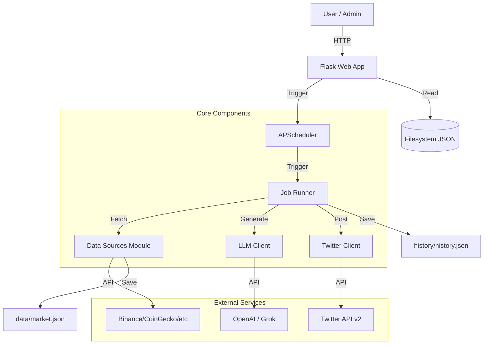

# Developer Documentation

## 1. Project Overview
This project is an automated Twitter (X) bot designed to generate and publish content using LLMs (OpenAI/Grok) and real-time market data. It features a Flask-based web interface for management and an APScheduler-based background system for automated tasks.

**Key Features:**
*   **Smart Tweet Generation**: Uses LLMs to generate engaging tweets.
*   **Daily Market Recap**: Automatically aggregates data from multiple sources (Binance, CoinGecko, etc.) to create comprehensive market analysis threads.
*   **Scheduling**: Flexible timezone-aware scheduling for automated posting.
*   **Web Interface**: Dashboard for status monitoring, manual triggering, and history viewing.

## 2. Architecture

The system follows a monolithic architecture with a web server and a background scheduler running in the same process.



## 3. Directory Structure

```text
twitter_bot/
├── app.py                  # Main entry point (Web App + Scheduler init)
├── config/                 # Configuration files
├── scheduler/              # Job scheduling logic (APScheduler)
├── twitter/                # Twitter API interactions (Tweepy)
├── llm/                    # LLM integration (OpenAI/Grok)
├── data_sources/           # Real-time market data fetching
├── recap/                  # Logic for generating daily recaps
├── history/                # History management
├── data/                   # Data storage (JSON files)
├── templates/              # HTML templates for Web UI
└── static/                 # Static assets (uploads, etc.)
```

## 4. Key Modules

### 4.1. Scheduler (`scheduler/job_scheduler.py`)
*   **Library**: `APScheduler` (BackgroundScheduler).
*   **Functionality**: Manages CRON-like jobs for daily tweets and market recaps.
*   **Features**: Supports timezone configuration (independent of server time), manual job triggering, and one-off scheduled tasks.

### 4.2. Twitter Client (`twitter/api_client.py`)
*   **Library**: `Tweepy`.
*   **Authentication**:
    *   **OAuth 2.0 (User Context)**: Used for posting tweets. Supports auto-refreshing of tokens using a refresh token.
    *   **OAuth 1.0a**: Used specifically for media uploads (image attachments), as standard v2 endpoints handles media differently.
*   **Resilience**: Implements retry logic for 401 Unauthorized errors to automatically refresh expired tokens.

### 4.3. Data Sources (`data_sources/fetch_real_data.py`)
*   **Purpose**: Aggregates data for the "Daily Recap" feature.
*   **Sources**:
    *   **CEX**: Binance, OKX (Prices, OKB).
    *   **Market**: CoinGecko (Global stats), Yahoo Finance (Macro: Gold, Oil, Nasdaq).
    *   **On-Chain/DeFi**: DefiLlama (TVL, DEX Volume), L2BEAT.
    *   **Sentiment**: Alternative.me (Fear & Greed Index).
    *   **News**: CryptoPanic (via API or RSS).

### 4.4. LLM Client (`llm/llm_client.py`)
*   **Library**: `openai` (v1.x).
*   **Providers**: Supports OpenAI (GPT-3.5/4) and xAI (Grok).
*   **Proxy**: Automatically configures HTTP/SOCKS5 proxies if enabled in settings.

## 5. Data Flow

### Daily Recap Workflow
1.  **Trigger**: Scheduler hits the configured time (e.g., 20:00).
2.  **Fetch**: `data_sources` module queries all external APIs.
3.  **Store**: Raw data is saved to `data/market.json`.
4.  **Generate**: `recap` module constructs a prompt with this data and sends it to the LLM.
5.  **Format**: LLM returns a thread structure (list of tweets).
6.  **Publish**: `twitter` client uploads any generated charts/images (if applicable) and posts the thread.
7.  **Archive**: Result is saved to `history` logs.

## 6. Setup and Configuration

### Prerequisites
*   Python 3.9+
*   Twitter Developer Account (API v2 Access)
*   OpenAI or xAI API Key

### Configuration (`config/config.yaml`)
*   **Proxy**: Essential for regions with restricted access to Twitter/OpenAI.
*   **Twitter**: Client ID, Client Secret, and Tokens.
*   **Scheduler**: Timezone and run times.

## 7. Architectural Risks & Recommendations

| Risk Category | Description | Recommendation |
| :--- | :--- | :--- |
| **External Dependency** | Heavy reliance on multiple free/public APIs (CoinGecko, etc.). Changes in their API rate limits or response formats will break the data fetching. | Implement caching, fallback data sources, and robust error handling for each individual source so one failure doesn't break the entire flow. |
| **Authentication** | OAuth 2.0 refresh tokens can expire or be revoked. The current "auto-refresh" logic works but requires manual re-auth if it fails completely. | Implement an alert system (email/webhook) when token refresh fails permanently. |
| **Data Persistence** | Data is stored in local JSON files (`data/`, `history/`). Container recreation or disk failure leads to data loss. | Use a proper database (SQLite/PostgreSQL) or ensure `data/` directories are mounted as persistent volumes in Docker. |
| **Concurrency** | Flask runs with `threaded=True` but it shares the process with APScheduler. Heavy compute in web requests could block the scheduler in some Python environments (GIL). | Keep web request processing lightweight. Offload heavy data processing to a task queue (like Celery) if scaling up. |
| **Proxy Reliability** | The bot is ensuring connectivity via SOCKS5/HTTP proxies. If the proxy goes down, the bot stops working. | Use a high-availability proxy service or implement failover proxy configurations. |
